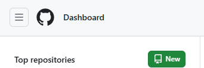
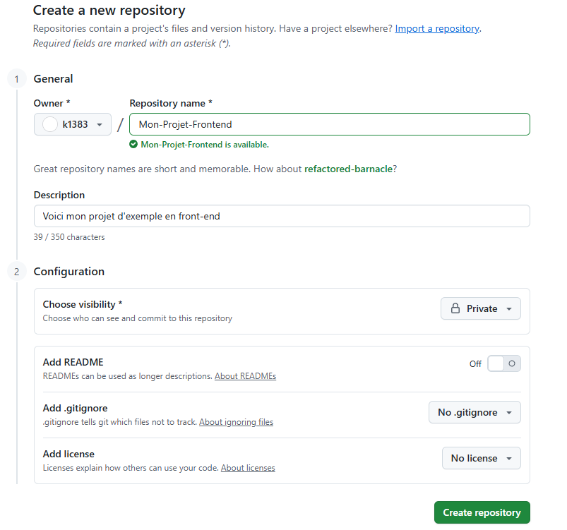
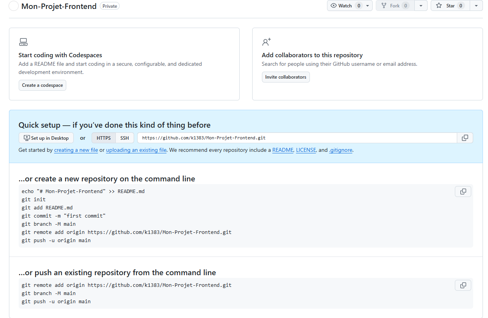
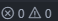

# Todo List
[](#) [](#)

## Table des matières
- [Description](#Description)
- [Objectif](#Objectif)
- [Installation](#Installation)
- [Aperçu](#Aperçu)
- [Déploiement](#Déploiement)

### Description
- **Todo List** est une application web permettant à un utilisateur de pouvoir créer une todo list, cocher s'il le souhaite pour indiquer qu'une tâche est fini ou pas et possibilité de supprimer une tâche 

### Objectif
Créer une todo list
Afficher toutes les todo list de l'utilisateur 
Mettre à jour une todo list
Supprimer une todo list

### Installation
npm 

#### Prérequis

1. Cloner le repo
```bash
git clone https://github.com/k1383/Todo-List-Front.git
cd Todo-List-Front
```

2. Installer les dépendances
- `npm install` (Pour installer les dépendances)
- `npm run dev` (et ctrl clic sur Local: http://localhost:)


### Aperçu 
Aperçu d'une todo list d'un utilisateur 
Nous pouvons **ajouter** une nouvelle tâche grâce formulaire, **cocher une tâche** si celci est terminer ou bien la **décocher** et ainsi on peux **supprimer** une tâche en cliquant sur la croix rouge  


### GitHub
Sauvegarder sur GitHub
1. Accéder au site [GitHub](https://github.com/)
2. Inscrivez vous ou Connecter vous 
3. Une fois sur la page d'accueil cliquer sur "New" dans le tableau de bord

4. Nommez votre projet (si vous faite un reposiroy GitHub seulement pour le front, n'oubliez pas de le préciser), exemple : Mon-Projet-Frontend
Vous avez le choix de mettre votre repository en Public ou Privé 
5. Cliquez sur (Create repository)

6. Nous arrivons sur cet page 

7. Aller sur votre vs code et ouvrez un terminal (crtl ù) ou pn clique sur 
Renseigner les commande suivante :
```
    - git init 
    - git add * 
    - git commit -m "first commit"
    - git branch -M main
    - git remote add main (votre lien donner par GitHub)
    - git push -u origin main
```
Puis recharger la page sur GitHub (ctrl r) et votre projet sera sur GitHub.
Pour les prochain commit vous pourriez taper
``` 
    - git add *
    - git commit -m "votre message"
    - git push 
```


### Déploiement

Déploiement du Front-end sur Render  

[Documentation / aide](https://docs.astro.build/fr/guides/deploy/render/)

1. Créez un [compte render.com](https://dashboard.render.com/) et connectez vous
2. Cliquez sur le bouton **New +** du tableau de bord et sélectionner **Static Site**
3. Connectez votre dépôt [GitHub](https://github.com/) ou [GitLab](https://about.gitlab.com/) ou entrez l’URL publique d’un dépôt public.
4. Donnez un nom à votre site web, sélectionnez la branche et spécifiez la commande de compilation et le répertoire de publication
    - **Build Command:** `npm run build`
    - **Publish Directory:** `dist` pour les sites statiques 

- Repository GitHub du [Back-end](https://github.com/k1383/Todo-List-back)