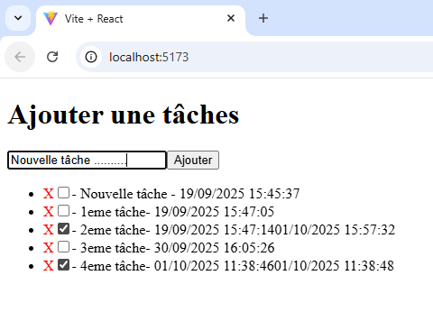
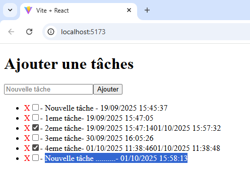

# Todo List
badge react à faire et javascript 

## Table des matières
- [Description](#Description)
- [Objectif](#Objectif)
- [Installation](#Installation)
- [Aperçu](#Aperçu)
- [Déploiement](#Déploiement)

### Description
- **Todo List** est une application web permettant à un utilisateur de pouvoir créer une todo list 

### Objectif
Créer une todo list
Afficher toutes les todo list de l'utilisateur 
Mettre à jour une todo list
Supprimer une todo list

### Installation
npm 

#### Prérequis

1. Cloner le repo
```bash
git clone https://github.com/k1383/Todo-List-Front.git
cd Todo-List-Front
```

2. Installer les dépendances
npm create vite@latest 
Project name → nom du projet
Select a framework → React
Select a variant → Javascript
npm install (Pour installer les dépendances)
npm install sass (Installer Sass)
npm install react-router-dom
npm run dev (et ctrl clic sur Local: http://localhost...)


### Aperçu 
Aperçu d'une todo list d'un utilisateur 
Nous pouvons **ajouter** une nouvelle tâche grâce formulaire, **cocher une tâche** si celci est terminer ou bien la **décocher** et ainsi on peux **supprimer** une tâche en cliquant sur la croix rouge  



### Déploiement

Déploiement du Front-end sur Render  

[Documentation / aide](https://docs.astro.build/fr/guides/deploy/render/)

1. Créez un [compte render.com](https://dashboard.render.com/) et connectez vous
2. Cliquez sur le bouton **New +** du tableau de bord et sélectionner **Static Site**
3. Connectez votre dépôt [GitHub](https://github.com/) ou [GitLab](https://about.gitlab.com/) ou entrez l’URL publique d’un dépôt public.
4. Donnez un nom à votre site web, sélectionnez la branche et spécifiez la commande de compilation et le répertoire de publication
    - **Build Command:** `npm run build`
    - **Publish Directory:** `dist` pour les sites statiques ; `dist/client` si vous avez des pages rendues à la demande.
5. Cliquez sur le bouton **Create Static Site**